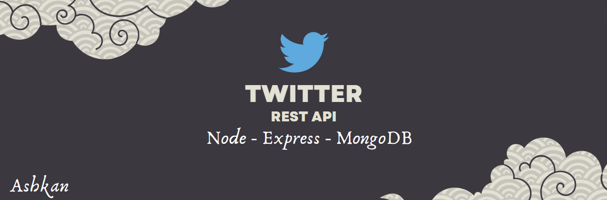

# A Twitter REST API With [Node](https://nodejs.org/), [Express](https://expressjs.com/), [MongoDB](https://www.mongodb.com/)



Features :

* MVC Architecture
* JsonWebToken  based Authentication
* User Profile Panel
* POST / DELETE / EDIT Note
* POST / EDIT / DELETE Comment
* Postman testing

### Description

A rest api I created to level up my skills

### Install packages
```
npm i
```
### Setup .env file
``` javascript
MONGODB_URL = 
PORT = 
```

### Start the app
```
npm run deva
```

<i>Ashkan<i>
